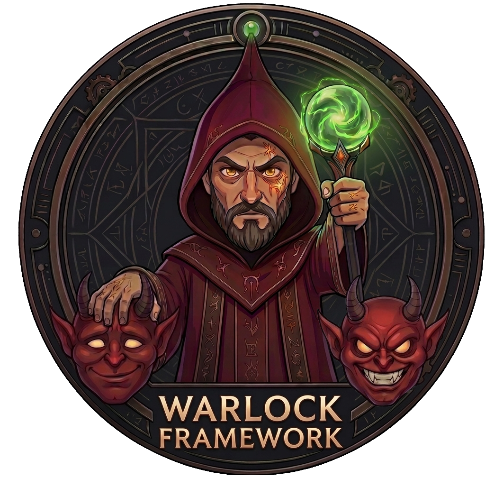

<p>
  
</p>

# Warlock

A from-scratch C++ reimplementation of a corryvreckan-style particle-track
reconstruction framework: it reads raw pixel/waveform hit data, clusters it,
fits tracks through a telescope of detector planes, and produces the same
class of physics output as the reference framework it was built to match.

Full reference documentation (architecture, every class/method) lives in
[`grimoire/`](grimoire/) - see [Documentation](#documentation) below.

## Building

### Dependencies

Required for the core `warlock` executable (`WarlockCore`/`WarlockModules`):

* CMake 3.14+
* A C++17 compiler
* HDF5, built with its C++ bindings (`find_package(HDF5 COMPONENTS CXX REQUIRED)`)
* POSIX threads (`find_package(Threads REQUIRED)`)
* Eigen 3.4.0 and toml++ 3.3.0 - fetched and built automatically by CMake at
  configure time (`FetchContent`), nothing to install yourself

Warlock itself never links against ROOT or EUDAQ - those are needed only by
the optional tools below, each gated behind its own CMake option:

| Tool | Purpose | Needs | Default | Enable/disable with |
|---|---|---|---|---|
| `minionRawConverter` | Converts raw EUDAQ data to Warlock's HDF5 input format | EUDAQ | **ON** | `-DBUILD_MINION_CONVERTER=OFF` |
| `minionRootPlotter` | Converts a run's output HDF5 plots to a ROOT file | ROOT | ON if ROOT is auto-detected, else OFF | `-DBUILD_MINION_PLOTTER=ON/OFF` |
| `minionSynchronizer` | Detects and corrects CAEN/MIMOSA event desynchronization | HDF5 only (already required) | **ON** | `-DBUILD_MINION_SYNCHRONIZER=OFF` |

`minionRawConverter` defaults to **ON**, and CMake looks for EUDAQ at a
hardcoded hint path (`/eudaq/eudaq/cmake`, meant for an EUDAQ-equipped build
container) - on a machine without EUDAQ installed there, configure will fail
outright unless you pass `-DBUILD_MINION_CONVERTER=OFF` explicitly.

### Build

```sh
mkdir build && cd build
cmake .. -DBUILD_MINION_CONVERTER=OFF   # omit the flag if EUDAQ is available
make -j$(nproc)
```

This builds `warlock` plus whichever of the three tools above ended up
enabled (`minionSynchronizer` and, if ROOT was found, `minionRootPlotter`
build by default even without EUDAQ).

## Running

```sh
./warlock -c <config.toml> [-o Module.key=value ...]
```

`-o` overrides apply on top of the config file, e.g.
`-o Warlock.threads=8 -o Warlock.number_of_events=30000`.

A config file has one `[Warlock]` block (global run settings: input/output
paths, `threads`, `batch_size`, event/track limits, ...) followed by one
`[ModuleName]` block per pipeline stage, in the order they should run - see
`temp/*.toml` for worked examples covering masking, alignment, tracking, and
waveform analysis.

## Running the minions

Each of the three optional tools built above (see [Building](#building)) is
a standalone CLI, independent of `warlock`'s own config-file pipeline.

### minionRawConverter

Decodes a raw EUDAQ data file into Warlock's HDF5 input format.

```sh
./minionRawConverter -i <in.raw> [-o <out.h5>] [-n <limit>] [-t <threads>] \
  [-x <description>]... [-s <description>]... [-w <description>]... \
  [-m <description>]
```

* `-i <in.raw>` - input file (required).
* `-o <out.h5>` - output file (default `output.h5`).
* `-n <limit>` - stop after this many events (default: no limit).
* `-t <threads>` - decode threads for producers not forced serial (default 1,
  i.e. fully sequential - always safe as a first run for any producer mix).
* `-x <description>` - skip decoding this raw producer entirely. Repeatable.
* `-s <description>` - force this producer to always decode sequentially,
  even under `-t` (for a converter whose thread-safety problem is ongoing/
  per-event, e.g. one that compares each event's trigger ID to the previous
  one). Repeatable.
* `-w <description>` - force this producer to decode sequentially for the
  file's first decode batch only, then allow it into the thread pool for
  every batch after (for a converter whose only shared-state problem is
  one-time lazy setup, e.g. a correction-table load). Repeatable.
* `-m <description>` - anchor event-window formation on this raw producer
  (matching corryvreckan's `sync_by_event`: whichever detector loader is
  declared first defines each event's boundary, and every other producer is
  matched against it instead of all producers being treated symmetrically).
  Omit to keep symmetric windowing.

The converter logs every distinct raw event description it encounters at
startup - run once without `-s`/`-w`/`-x` first to see what strings a given
file actually uses before deciding what to pass.

### minionRootPlotter

Converts one run's output HDF5 plots (`output_plots_file` from a `warlock`
run) into a ROOT file, for viewing in a `TBrowser` or any ROOT-based script.

```sh
./minionRootPlotter <input.h5> [output.root]
```

`output.root` defaults to `<input>` with its extension replaced by `.root`.

### minionSynchronizer

Detects (and, once reviewed, corrects) an event-index desync between a CAEN
digitizer and the MIMOSA telescope - a rare but real failure mode where one
readout stream drifts out of sync with the others partway through a run.
Two-phase workflow, deliberately never fully automatic since it edits real
experiment data:

```sh
# 1. Detect mode (default) - reports the group's shared onset and shift
#    trajectory, writes nothing.
./minionSynchronizer <tracks.h5> <waveforms.h5> <geometry.geo> -d <det1,det2,...> \
  [--min-snr <v>] [--max-snr <v>] [--min-amplitude <v>] [--max-amplitude <v>] \
  [--min-noise <v>] [--max-noise <v>] [--min-rise-time <v>] [--max-rise-time <v>] \
  [--min-start-time <v>] [--max-start-time <v>] [--min-charge <v>] [--max-charge <v>] \
  [--cfd <v>] [--sensoredge <v>] \
  [--cusum-baseline <n>] [--cusum-slack <v>] [--cusum-threshold <v>] \
  [--shift-window <n>] [--shift-band <n>]

# 2. Apply mode - once you've reviewed detect mode's report, shift every
#    detector in -d's group by its detected trajectory and write a new file.
./minionSynchronizer <tracks.h5> <waveforms.h5> <geometry.geo> -d <det1,det2,...> \
  -y -o <output.h5> [same cut/cfd flags as above]
```

* `<tracks.h5> <waveforms.h5> <geometry.geo>` - positional, all three
  required: a `Tracking4D`-fitted tracks file, a `WaveformProcessingCAEN`
  waveform-parameters file, and the run's detector geometry.
* `-d <det1,det2,...>` - the detector group to analyze jointly (every
  detector sharing one physical digitizer). Required for apply mode. Omit
  entirely to check every detector in the geometry independently, each as
  its own group of one (no cross-detector combination).
* The `--min-*`/`--max-*`/`--cfd`/`--sensoredge` flags mirror
  `WaveformSelector`'s own cut names and defaults - set them to whatever the
  real analysis config uses.
* `--cusum-baseline`/`--cusum-slack`/`--cusum-threshold` tune the per-detector
  CUSUM changepoint detection run before combining detectors in a group.
* `--shift-window`/`--shift-band` tune the pooled banded shift search run
  from the detected shared onset onward.
* `-y` - apply mode: use this run's own detected trajectory (needs `-d`).
* `-o <output.h5>` - apply mode output path (default `<waveforms>_corrected.h5`).
* `-p` - allow overwriting `waveforms.h5` in place (refused by default, since
  that's a real, hard-to-reverse edit).

## Architecture, in brief

A run is one `FrameworkManager`, which parses the config into a pipeline of
`Module` instances (one per `[ModuleName]` block), then repeatedly loads one
batch of events into a shared `DataBatch` and runs every module's
`run(DataBatch&)` over it in pipeline order - each module reads a field an
upstream module wrote and writes a field a downstream one will read
(pixels -> clusters -> tracks; waveforms are the one independent branch).
Everything CPU-heavy runs across a single `ThreadPool`, constructed once and
shared by every module.

```
src/
  core/       Module/DataBatch, FrameworkManager, ThreadPool, Configuration,
              GeometryManager, PlotManager, Logger, AppendableDataset
  modules/    One directory per pipeline stage (EventLoaderHDF5,
              ClusteringSpatial, Tracking4D, WaveformProcessingCAEN,
              MaskCreator, ...)
  objects/    Pixel, Cluster, Track, Waveform
tools/        minionRawConverter, minionRootPlotter, minionSynchronizer
              (see Building/Running the minions above)
grimoire/     Doxygen config + generated reference documentation
```

## Documentation

`grimoire/` holds the project's Doxygen setup and generated docs. To
(re)build them locally:

```sh
doxygen Doxyfile
```

Open `grimoire/html/index.html` in a browser. `grimoire/mainpage.md` is the
documentation's own landing page - a good starting point for a reading order
through the codebase.
